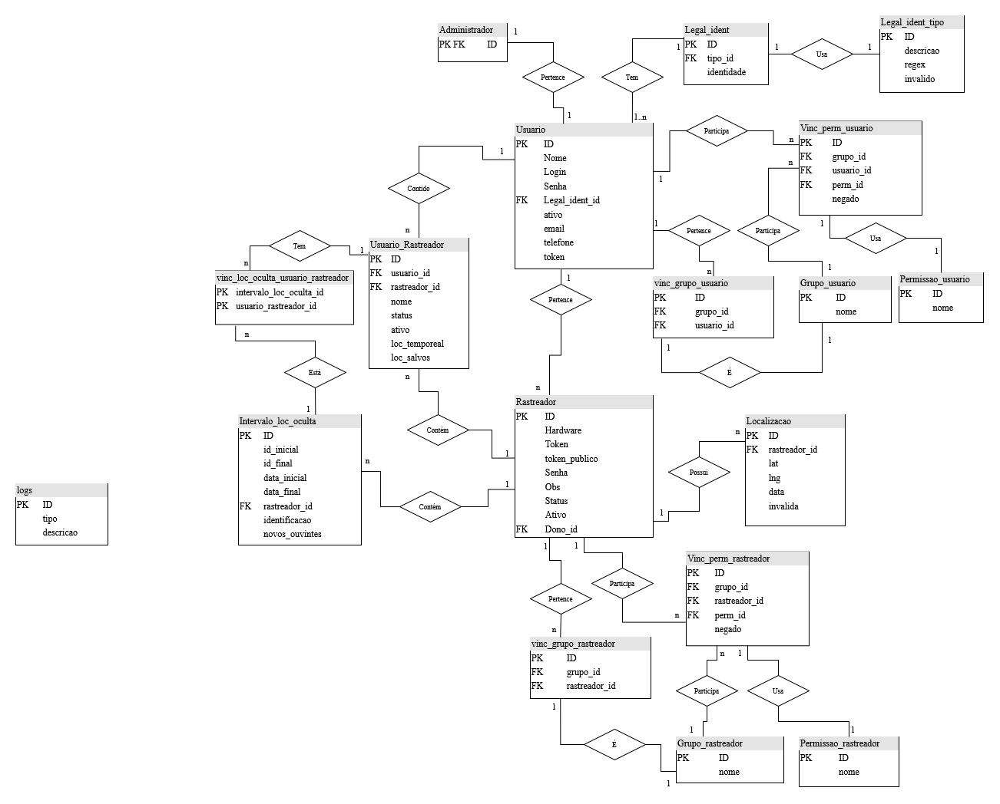

## Tabela de Instância - Tuplas concretas de algumas tabelas, e seu significado.

1. Usuario_Rastreador
    1. status
        | Numero | Significado |
        | :-: | :- |
        | 1 | (registrado) Recebendo rastreio normalmente |
        | 2 | (registrado) Visualização do rastreio pausada |
        | 3 | (não registrado) o usuario está aguardando o dono aprovar sua inclusão |
        | 4 | (não registrado) o dono está aguardando um usuario aceitar a proposta |
        | 5 | (registrado) Este ouvinte recebeu um pedido de transferência, o dono espera pela resposta |
    1. ativo
        | Booleano | Significado |
        | :-: | :- |
        | True | o usuario pode ver as localizações |
        | False | as localizações não são mais permitidas (nem pro dono) |
1. Permissao_usuario
    | ID | nome | descrição |
    | :-: | :-: | :- |
    | 1 | Login | usuario fazer login no sistema |
    | 2 | Ver Mapa | usuario visualizar mapa (carregar API) |
    | 3 | Registrar Rastreador | usuario registra um rastreador com ou sem dono |
    | 4 | Modificar Rastreador | usuario altera informações do rastreador próprio |
    | 5 | Modificar Perfil | usuario altera informações do próprio perfil |
    | 6 | Transferir Posse | dono transfere seu rastreador para um ouvinte | 
    | 7 | Gerenciar ouvintes | dono inclui/aceita/pausa/retoma um ouvinte |
    | 8 | Rastreio Salvo | usuario recebe as localizações já salvas |
    | 9 | Rastreio T.R. | usuario recebe as localizações em tempo real |
    | 10 | Quer Propostas Rastreio | usuario deseja receber propostas de ser ouvinte |
    | 11 | Proposta Rastreio | usuario recebe propostas de ser ouvinte |
    | 12 | Intervalo Oculto | dono pode criar intervalo para ocultar rastreio |
    | 13 | Desativar Rastreador | dono pode desativar novas atualizações do rastreador |
1. Permissao_rastreador
    | ID | nome | descrição |
    | :-: | :-: | :- |
    | 1 | Conexão | rastreador se conecta ao servidor |
    | 2 | Enviar Localização | rastreador pode registrar localizações |
    | 3 | Resgistrável | usuarios registram o rastreador |
    | 4 | Rastreável R.T | o rastreador envia suas localizações pros usuarios em tempo real |
    | 5 | Rastreável | o rastreador envia suas localizações salvas pros usuarios |
    | 6 | Ouvintes | usuarios pedem para ser ouvintes do rastreador |
1. Rastreador
    1. status
        | Numero | Significado |
        | :-: | :- |
        | 1 | Operando normalmente |
        | 2 | O dono desligou o salvamento de novas localizações |
        | 3 | O dono iniciou o processo de transferência, algumas funções são desligadas |
        | 4 | O dono desativou, o sistema age como se não existisse |
    1. ativo
        | Booleano | Significado |
        | :-: | :- |
        | False | O sistema age como se não existisse, nem mesmo em relatórios |
1. Usuario
    1. ativo
        | Booleano | Significado |
        | :-: | :- |
        | False | O sistema só processa questões de relatórios, mas o usuario fica como se não existisse |

